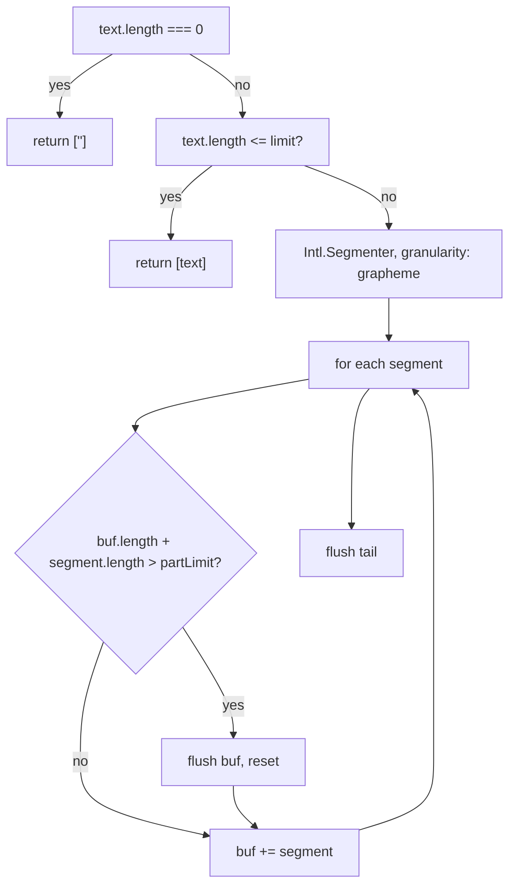

`chunkByGrapheme(text, options)` splits a string by walking **grapheme
clusters** with `Intl.Segmenter`, accumulating segments into a buffer and
flushing whenever the next segment would exceed the part limit. Because it never
cuts inside a cluster, an emoji, a regional-indicator flag pair, or a combining
sequence always survives intact.[^code]

It is a **genuinely different algorithm** from
[`chunkText`](/core-api/chunk-text.md), not a variant of it — it searches no
boundaries and applies no preference order. That is exactly why the
[architecture-hardening effort](/initiatives/architecture-hardening.md) kept the
two primitives separate instead of forcing one abstraction over both.

# Schema — `ChunkByGraphemeOptions`

| Option | Type | Default | Meaning |
|---|---|---|---|
| `limit` | `number` | — (required) | If `text.length <= limit`, the input is returned as a single chunk. |
| `partLimit` | `number` | `limit` | Max length per emitted part during the walk. Callers reserving room for a per-part prefix pass a value below `limit`. |

Both are `readonly`. The function returns `string[]`.

# Behaviour worth knowing

- Empty input returns `[""]` — one empty chunk, not an empty array.
- `limit` and `partLimit` must both be positive integers; otherwise
  `RangeError`, the same fail-fast contract
  [`chunkText`](/core-api/chunk-text.md) got during review remediation.
- The short-circuit compares `text.length` (UTF-16 code units) against `limit`,
  while the walk compares against `partLimit`. When a caller sets
  `partLimit < limit`, a string between the two lengths still returns as one
  chunk via the fast path.



# Examples

```typescript
// LINE — plain 5000-char cap, no prefix to reserve for
chunkByGrapheme(text, { limit: 5000 });

// SMS — reserve 8 chars for the "(99/99) " worst-case part prefix
const parts = chunkByGrapheme(text, { limit: 1600, partLimit: 1600 - 8 });
```

# Callers

Two adapters wrap it: [gateway-line](/packages/gateway-line.md), which passes
only `limit`, and [gateway-sms](/packages/gateway-sms.md), which reserves eight
characters for its `(i/N) ` part prefix and then prefixes each part. It is
exported from [`@theokit/gateway`](/packages/theokit-gateway.md).

# Known limitation carried over

The SMS `(i/N) ` prefix reserves eight characters. At 100 or more parts — a
message beyond roughly 158,000 characters — a part can exceed the limit by two.
The review recorded this as pre-existing, SMS-specific, and byte-identical to
the behaviour before the extraction, therefore out of scope rather than
introduced.[^review]

[^code]: `chunkByGrapheme` source, `@theokit/gateway`
[^review]: Architecture-hardening review, 2026-07-10
