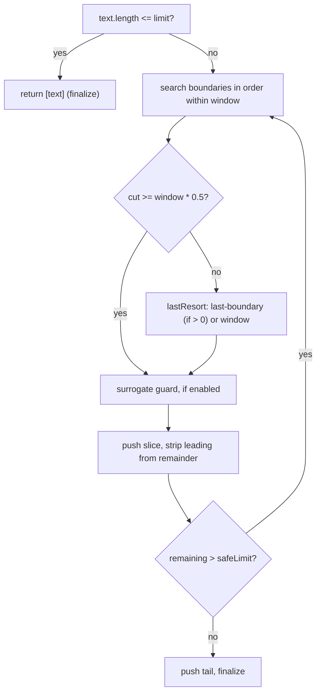

`chunkText(text, options)` splits a string into chunks no longer than a
configured window, preferring natural boundaries over blind slicing. It was
extracted in milestone M0 of the
[architecture-hardening effort](/initiatives/architecture-hardening.md) to
single-source a splitting algorithm that had been copy-pasted across the adapter
packages, and it reproduces **byte-for-byte** the two boundary-search families
that existed there.[^code]

Slack family
: Slack, WhatsApp, Teams. Fixed window (`safeLimit === limit`), boundary
  preference `"\n\n" → "\n" → " "`, UTF-16 surrogate-pair guard,
  leading-whitespace strip on continuation, optional part trim.

Telegram family
: Telegram, Discord. Soft window (`safeLimit < limit`), boundary preference
  `"\n\n" → "\n"` with no space, no surrogate guard, leading-newline strip on
  continuation.

Two things are deliberately **not** folded in. The grapheme family (LINE, SMS)
is a genuinely different algorithm and keeps its own primitive,
[`chunkByGrapheme`](/core-api/chunk-by-grapheme.md). Telegram's markdown-pair
balancing stays adapter-local in
[gateway-telegram](/packages/gateway-telegram.md), because merging distinct
knowledge would be accidental coupling, not DRY.

# Schema — `ChunkTextOptions`

| Option | Type | Default | Meaning |
|---|---|---|---|
| `limit` | `number` | — (required) | Hard cap. Input `<= limit` returns as a single chunk, subject to `trimParts`. |
| `safeLimit` | `number` | `limit` | Soft window each cut searches within. The Telegram family passes a value strictly below `limit` (e.g. 1900 < 2000). |
| `boundaries` | `readonly string[]` | `["\n\n", "\n", " "]` | Boundary strings tried most- to least-preferred. |
| `lastResort` | `"last-boundary" \| "window"` | `"window"` | Fallback when no boundary reaches the half-window threshold. `"last-boundary"` uses the last computed boundary when it is `> 0` (Slack family); `"window"` cuts at the window edge (Telegram family). |
| `surrogateGuard` | `boolean` | `false` | Step back one code unit rather than slice through a UTF-16 low surrogate (splitting an emoji). |
| `stripLeading` | `RegExp` | `/^\n+/` | Pattern stripped from the start of each continuation chunk. The Slack family passes `/^\s+/`. |
| `trimParts` | `boolean` | `false` | Trim every part and drop empties (WhatsApp, Teams). Also applied on the single-chunk fast path. |

All options are `readonly`. The function returns `string[]`.

# Algorithm

A boundary is accepted once its position is at least half the window:

$$\text{cut} = \max\{\, p \mid p = \mathrm{lastIndexOf}(b,\ w),\ b \in B,\ p \ge 0.5\,w \,\}$$

where $w$ is the window (`safeLimit`) and $B$ the ordered `boundaries` list. The
first boundary in $B$ that clears $0.5\,w$ wins; if none does, `lastResort`
decides. A cut of `<= 0` always falls back to the window edge, so the loop
cannot stall.



# Fail-fast contract

Input validation is at the boundary and throws `RangeError` — added during
review remediation, not in the original extraction:[^review]

- `limit` must be a positive integer. A non-positive `limit` would make the cut
  search return `0` forever and **hang the loop** (found as a HIGH severity
  defect).
- `safeLimit` must be a positive integer.
- `safeLimit > limit` is rejected, because it would emit an oversized tail chunk
  and break the hard-cap contract (found as MEDIUM).

# Examples

```typescript
// Slack family — fixed 4000 window, space boundary allowed, surrogate-safe
chunkText(text, {
  limit: 4000,
  boundaries: ["\n\n", "\n", " "],
  lastResort: "last-boundary",
  surrogateGuard: true,
  stripLeading: /^\s+/,
});

// Telegram family — soft 1900 window inside a hard 2000 cap, no space boundary
chunkText(text, {
  limit: 2000,
  safeLimit: 1900,
  boundaries: ["\n\n", "\n"],
  lastResort: "window",
  stripLeading: /^\n+/,
});
```

# Callers

Four adapters wrap it as a thin, one-call `split.ts`:
[gateway-slack](/packages/gateway-slack.md) (4000),
[gateway-whatsapp](/packages/gateway-whatsapp.md) (4096),
[gateway-teams](/packages/gateway-teams.md) (8000) and
[gateway-discord](/packages/gateway-discord.md) (2000 / 1900). It is exported
from [`@theokit/gateway`](/packages/theokit-gateway.md).

[^code]: `chunkText` source, `@theokit/gateway`
[^review]: Architecture-hardening review, 2026-07-10
