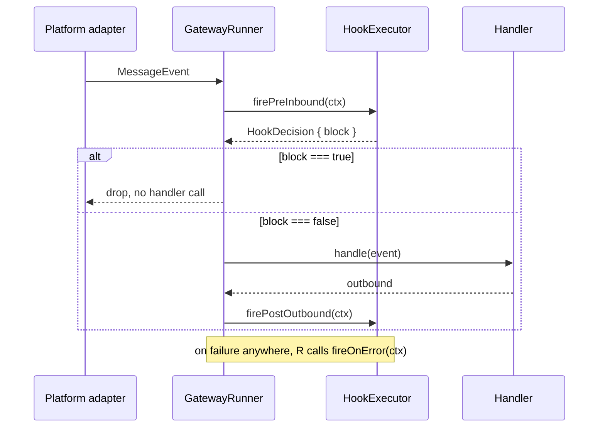

`HookExecutor` runs the registered [gateway hooks](/glossary.md) at their fire
points. Milestone M0 of the
[architecture-hardening effort](/initiatives/architecture-hardening.md) split it
out of `hooks/types.ts`, which now holds the contract only, so the filename
predicts its contents: interfaces in `types.ts`, the run engine in
`executor.ts`. Behaviour is identical to the previous colocated class — the split
was structural clarity, not a change.[^code]

The class is **stateless**, so it is safe to construct per-event when hooks need
event-scoped storage. It is constructed with a `ReadonlyArray<GatewayHook>`.

# Schema — fire points

| Method | Context | Semantics on a hook throwing |
|---|---|---|
| `firePreInbound(ctx)` → `Promise<HookDecision>` | `PreInboundContext` | Sequential. The first `{ block: true }` short-circuits. A throw is **treated as a block**, with the message `` `hook ${name} threw: ${err.message}` ``. |
| `firePostOutbound(ctx)` → `Promise<void>` | `PostOutboundContext` | All hooks run. A throw is caught and written to `stderr` as `[gateway] post_outbound hook "<name>" threw: …`. |
| `fireOnError(ctx)` → `Promise<void>` | `OnErrorContext` | All hooks run. Same `stderr` handling as `post_outbound`. |

Hooks that do not implement a given fire point are skipped by an
`=== undefined` check rather than a truthiness test.

The asymmetry is the design: `pre_inbound` is a **gate**, so an exception there
must not silently let a message through — it fails closed. `post_outbound` and
`on_error` are **observers**, so one broken observer must not take down delivery
or mask the original error; they fail open and log.

# Related contract types

`GatewayHook`, `HookDecision`, `HookName`, `PreInboundContext`,
`PostOutboundContext` and `OnErrorContext` all live in `hooks/types.ts` and are
re-exported from the barrel.[^types] They are the "interfaces" half of the split
that produced this class.

# Role in this bundle

Exported from [`@theokit/gateway`](/packages/theokit-gateway.md) alongside
[`chunkText`](/core-api/chunk-text.md),
[`chunkByGrapheme`](/core-api/chunk-by-grapheme.md),
[`GatewayConfigurationError`](/core-api/gateway-configuration-error.md) and
[`MessageEvent`](/core-api/message-event.md). Unlike those, `HookExecutor` was
not new API in the hardening effort — it was **moved**, which is why the
[v1.9.0 release](/releases/v1-9-0.md) lists it under structural work rather than
under the new public surface.

[^code]: `HookExecutor` source, `@theokit/gateway`
[^types]: Hook contract types, `@theokit/gateway`
