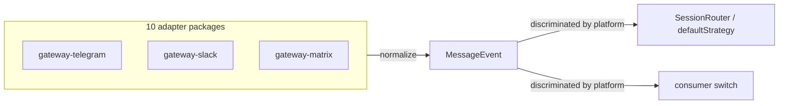

`MessageEvent` is the single inbound shape every platform adapter normalizes to.
It is a **discriminated union keyed by `platform`**, so a consumer writes one
`switch` and the compiler proves every platform is handled. Platform-specific
extras live in an optional sibling field named after the platform
(`telegram?`, `discord?`, …), typed by that platform's variant.[^code]

The union is **closed** by decision, not by accident — see
[ADR-0001](/decisions/adr-0001-message-event-closed-union.md) for why exhaustive
narrowing beat Open/Closed purity here.[^adr]

# Schema — `BaseMessageEvent`

Every variant extends this.

| Field | Type | Meaning |
|---|---|---|
| `id` | `string` | Stable id, used as a session-key segment and for dedup. |
| `platform` | `PlatformName` | The discriminator. |
| `sender` | `{ id, username?, displayName? }` | Sender identity, opaque and platform-namespaced. |
| `channel` | `{ id, type, topicId? }` | Channel/chat scope. `type` is `"dm" \| "group" \| "thread"`. |
| `text` | `string` | Plain-text content; the caption for media-only messages, `""` when absent. |
| `receivedAt` | `number` | Receipt timestamp, ms since epoch. |
| `replyTo` | `string?` | Reply-target message id. |

All fields are `readonly`.

# Schema — `PlatformName`

The closed enum of supported transports. Ten literals, one per adapter package:

`"telegram"` · `"discord"` · `"slack"` · `"whatsapp"` · `"teams"` · `"email"` ·
`"sms"` · `"mattermost"` · `"line"` · `"matrix"`

# Schema — the ten variants

Each variant pins `platform` to its literal and adds one namespaced extras
object. Every variant's extras carry a `raw: unknown` escape hatch that the
adapter package narrows.

| Variant | Extras field | Notable keys |
|---|---|---|
| `TelegramMessageEvent` | `telegram` | `chatId: number`, `messageId: number`, `threadId?: number`, `raw` (grammy `Context`) |
| `DiscordMessageEvent` | `discord` | `guildId: string \| null`, `channelId`, `messageId`, `raw` (discord.js `Message`) |
| `SlackMessageEvent` | `slack` | `teamId: string \| undefined`, `channelId`, `userId` (or `"anonymous"`), `ts` (canonical message id), `threadTs?`, `subtype?` |
| `WhatsAppMessageEvent` | `whatsapp` | `wamid` (`wamid.xxx` cloud / `msg.id._serialized` web), `phoneNumberId?` (cloud only), `contactName?`, `backend: "cloud" \| "web"` |
| `TeamsMessageEvent` | `teams` | `activityId`, `conversationId`, `conversationType` (`"personal" \| "groupChat" \| "channel"` open), `tenantId?`, `channelId?`, `teamId?` |
| `EmailMessageEvent` | `email` | `messageId` (no `<>`), `inReplyTo?`, `references?`, `subject` (fallback `"(no subject)"`), `fromAddress` (lowercased), `fromName?`, `recipients` (bot's own address excluded), `attachmentCount` |
| `SMSMessageEvent` | `sms` | `backend: "twilio" \| "plivo" \| "vonage"`, `messageId`, `from` / `to` in E.164 |
| `MattermostMessageEvent` | `mattermost` | `postId`, `channelId`, `teamId`, `rootId?` (thread root), `channelType` (`"D" \| "G" \| "O" \| "P"`, pre-normalization) |
| `LineMessageEvent` | `line` | `sourceType: "user" \| "group" \| "room"`, `sourceId`, `messageId`, `mentionees`, `replyToken?` (one-shot, 60 s TTL — adapter-managed) |
| `MatrixMessageEvent` | `matrix` | `roomId` (`!xxx:server`), `eventId` (`$xxx:server`), `memberCount` (drives DM detection) |

# Examples

The default narrow pattern — the `never` branch is what makes the union's
closedness pay:

```typescript
function threadKey(event: MessageEvent): string {
  switch (event.platform) {
    case "telegram": return String(event.telegram.threadId ?? event.telegram.chatId);
    case "discord":  return event.discord.channelId;
    case "slack":    return event.slack.threadTs ?? event.slack.ts;
    // … every platform …
    default: {
      const _exhaustive: never = event; // compile error if a platform is unhandled
      return _exhaustive;
    }
  }
}
```



# Role in this bundle

The type lives in [`@theokit/gateway`](/packages/theokit-gateway.md) and is
produced by all ten adapters, from [gateway-telegram](/packages/gateway-telegram.md)
to [gateway-matrix](/packages/gateway-matrix.md). Its closedness is the subject
of [ADR-0001](/decisions/adr-0001-message-event-closed-union.md);
[ADR-0002](/decisions/adr-0002-type-file-naming-convention.md) uses it as the
boundary that decides what does *not* belong in a per-package `types.ts`.

[^code]: `MessageEvent` source, `@theokit/gateway`
[^adr]: ADR-0001, closed union decision
