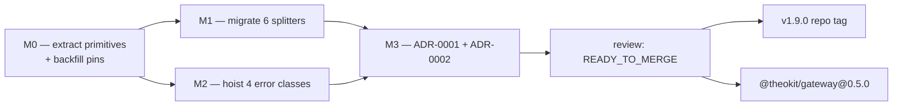

The effort every other record in this bundle refers back to. It ran the four
milestones M0–M3 in July 2026, gated by the
[architecture-hardening review](/reviews/architecture-hardening-2026-07-10.md)
and shipped as [v1.9.0](/releases/v1-9-0.md) plus
[`@theokit/gateway@0.5.0`](/releases/theokit-gateway-0-5-0-npm.md).

It was **not** a greenfield inception. The roadmap was derived from a 6-phase
automated architecture audit that scored the repo **91/100 — keep / refactor
lightly**, and the milestones are that audit's own 10-step migration plan grouped
into shippable slices.[^arch-report]

# The problem it solved

Duplicated **knowledge**, not duplicated lines. Two shapes of it:[^roadmap]

- The same boundary-preferring text-chunking algorithm copy-pasted across
  **7 sites** — two families plus one legitimately distinct Telegram variant.
- The `ConfigurationError` class body copy-pasted verbatim across what the audit
  believed were **8 packages** (the review later corrected this to 4).

Roughly 120–150 lines of DRY-of-knowledge duplication. The cost was not the
lines: a single edge-case fix had to be applied in six places, and an
error-contract change touched eight files. Two structural nits compounded it —
`hooks/types.ts` hid the `HookExecutor` class, and the closed
[`MessageEvent`](/core-api/message-event.md) union was an **undocumented**
Open/Closed trade-off.

**Whose pain:** maintainers of the gateway cluster. Every duplicated site is a
place a bug fix can be forgotten, and every new platform adapter re-copied the
boilerplate.

# Milestones

- [x] **M0 — extract.** Core [`chunkText`](/core-api/chunk-text.md) with golden
      oracle tests, [`chunkByGrapheme`](/core-api/chunk-by-grapheme.md), the
      [`GatewayConfigurationError`](/core-api/gateway-configuration-error.md)
      base, and [`HookExecutor`](/core-api/hook-executor.md) split out of
      `hooks/types.ts`. Crucially, the **safety-net pins came first**: a
      `split.test.ts` for discord and four missing `errors.test.ts` were
      backfilled *before* anything was converted, so byte-identity could be
      proved rather than asserted.
- [x] **M1 — migrate the splitters.** Six adapter `split.ts` reduced to thin
      wrappers: [slack](/packages/gateway-slack.md),
      [whatsapp](/packages/gateway-whatsapp.md),
      [teams](/packages/gateway-teams.md) and
      [discord](/packages/gateway-discord.md) onto `chunkText`;
      [line](/packages/gateway-line.md) and [sms](/packages/gateway-sms.md) onto
      `chunkByGrapheme`. [telegram](/packages/gateway-telegram.md) left distinct.
- [x] **M2 — hoist the error base.** Four `ConfigurationError` classes —
      [line](/packages/gateway-line.md), [matrix](/packages/gateway-matrix.md),
      [mattermost](/packages/gateway-mattermost.md),
      [sms](/packages/gateway-sms.md) — repointed onto the core base.
- [x] **M3 — record the decisions.**
      [ADR-0001](/decisions/adr-0001-message-event-closed-union.md) and
      [ADR-0002](/decisions/adr-0002-type-file-naming-convention.md), plus a
      docstring pointer from the union to the ADR; final gate.

# What was explicitly out of scope

The three exclusions are as load-bearing as the inclusions, because each is a
refusal to do something that would have looked like an improvement:

1. **Opening the `MessageEvent` union for OCP purity.** It would trade
   compile-time exhaustiveness for runtime uncertainty. Pattern theater.
   Documented as an accepted trade-off in
   [ADR-0001](/decisions/adr-0001-message-event-closed-union.md), not "fixed".
2. **Force-unifying telegram's markdown-aware split into the shared chunker.**
   It is legitimately distinct knowledge — markdown-pair balancing — and merging
   it would be accidental coupling, which is a DRY anti-pattern rather than DRY.
3. **Any boundary rework, re-layering, or rewrite.** The audit scored coupling,
   cohesion and structure at 90 or above; there was nothing to restructure. Every
   change was additive-then-rewire.

# Outcome

Behaviour preserved end-to-end, byte-identical where it mattered and
golden-pinned to prove it. Test count went from 543 to 583. Zero circular
dependencies throughout. Two real defects were found *by the review, not by the
tests* — an infinite loop and a broken hard-cap contract in `chunkText` — and
fixed before release.

The durable result: a surrogate-pair edge-case fix or an error-contract change
now lives in **one** place, and adding an eleventh gateway carries no split or
error boilerplate.[^review]

[^roadmap]: `ROADMAP.md`, architecture-hardening roadmap
[^review]: Architecture-hardening review, 2026-07-10
[^arch-report]: Automated architecture audit, score 91/100
