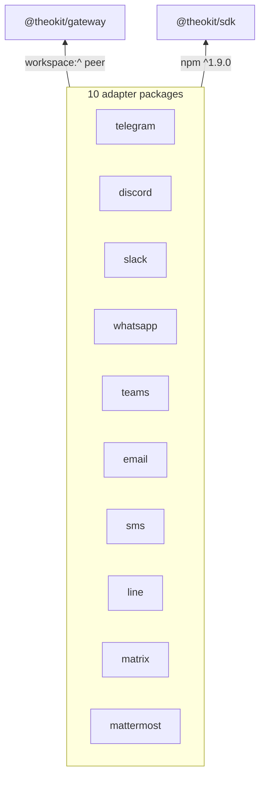

`@theokit/gateway` is the core of the gateway cluster: everything that is true
of *messaging* regardless of *platform*. It is deliberately **SDK-agnostic** —
it imports no platform SDK — which is one of the invariants the milestone gate
re-checks on every release.[^manifest]

It is the most-depended-on module in the repo. Afferent coupling
$C_a = 10$ (all ten adapters), instability $I \approx 0.09$. That stability is
what makes [ADR-0001](/decisions/adr-0001-message-event-closed-union.md)'s
trade-off worth stating explicitly: a stable core that owns the platform union
must be edited to add a platform.

Adapters consume it as a **workspace peer dependency** (`workspace:^`), which is
the fact that shaped the [0.5.0 publish strategy](/releases/theokit-gateway-0-5-0-npm.md).

# Schema — public exports

The barrel is the contract; nothing is reachable by deep import.[^barrel]

| Area | Exports |
|---|---|
| Adapter contract | `BasePlatformAdapter`, `OutboundMessage`, `SendResult` |
| Delivery | `DeliveryRouter`, `DeliveryRequest`, `DeliveryTarget` |
| Errors | [`GatewayConfigurationError`](/core-api/gateway-configuration-error.md), `GatewayConfigurationErrorOptions` |
| Hooks | [`HookExecutor`](/core-api/hook-executor.md), `GatewayHook`, `HookDecision`, `HookName`, `PreInboundContext`, `PostOutboundContext`, `OnErrorContext` |
| Runner | `GatewayRunner`, `GatewayRunnerOptions`, `GatewayContext`, `GatewayHandler` |
| Session | `SessionRouter`, `AgentIdStrategy`, `defaultStrategy` |
| Text | [`chunkText`](/core-api/chunk-text.md), [`chunkByGrapheme`](/core-api/chunk-by-grapheme.md), `ChunkTextOptions`, `ChunkByGraphemeOptions` |
| Types | [`MessageEvent`](/core-api/message-event.md), `BaseMessageEvent`, `PlatformName`, and the ten platform variants |

# Source layout

```
packages/gateway/src/
  adapter/base.ts          BasePlatformAdapter — the contract adapters implement
  delivery/router.ts       DeliveryRouter
  errors/config-error.ts   GatewayConfigurationError
  hooks/executor.ts        HookExecutor          (split from types.ts, M0)
  hooks/types.ts           hook contract types
  runner/gateway-runner.ts GatewayRunner
  session/router.ts        SessionRouter, defaultStrategy
  text/chunk.ts            chunkText, chunkByGrapheme
  types/message-event.ts   MessageEvent and its ten variants
  index.ts                 the barrel
```

# Versions

Published at **0.5.0** on npm under the `latest` dist-tag. The minor bump from
0.4.1 carried the three new public symbols the hardening effort added —
`chunkText`, `chunkByGrapheme`, `GatewayConfigurationError`.[^npm-release]

# The ten adapters that depend on it

[gateway-telegram](/packages/gateway-telegram.md) ·
[gateway-discord](/packages/gateway-discord.md) ·
[gateway-slack](/packages/gateway-slack.md) ·
[gateway-whatsapp](/packages/gateway-whatsapp.md) ·
[gateway-teams](/packages/gateway-teams.md) ·
[gateway-email](/packages/gateway-email.md) ·
[gateway-sms](/packages/gateway-sms.md) ·
[gateway-line](/packages/gateway-line.md) ·
[gateway-matrix](/packages/gateway-matrix.md) ·
[gateway-mattermost](/packages/gateway-mattermost.md)



Every adapter also depends on `@theokit/sdk` as a published npm dependency
(`^1.9.0`); core does not.

[^manifest]: Package manifest at `c891696`
[^barrel]: Public barrel, `packages/gateway/src/index.ts`
[^npm-release]: `@theokit/gateway@0.5.0` npm publish record
