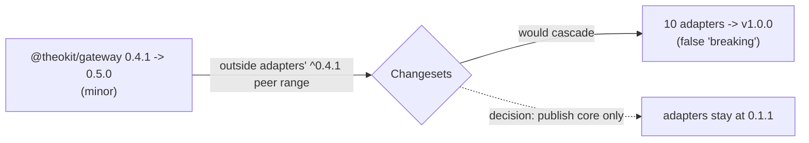

**Verdict: PUBLISHED** · 2026-07-10 · minor bump 0.4.1 → 0.5.0.[^record]

The publish that actually put the
[architecture-hardening](/initiatives/architecture-hardening.md) API in
consumers' hands — the [v1.9.0 repo tag](/releases/v1-9-0.md) did not.

| Field | Value |
|---|---|
| Registry | <https://registry.npmjs.org/> — `@theokit/gateway@0.5.0`, dist-tag `latest`, public access, published by `usetheodev` |
| Commit | `39a4459` `chore(release): @theokit/gateway@0.5.0` on `develop` |
| Tag | `@theokit/gateway@0.5.0`, annotated and pushed — the per-package Changesets tag convention |
| Tarball | 9 files, 46.6 kB packed / 164.3 kB unpacked, shasum `9dba41d2…` |
| Bump rationale | New public API — [`chunkText`](/core-api/chunk-text.md), [`chunkByGrapheme`](/core-api/chunk-by-grapheme.md), [`GatewayConfigurationError`](/core-api/gateway-configuration-error.md) |

# Strategy — core-only publish

Only [`@theokit/gateway`](/packages/theokit-gateway.md) was published. The ten
adapters were **not** republished, and the reasoning is the part worth keeping:

1. The hardening refactor is byte-identical for consumers, golden-pinned. The
   adapters gained nothing a consumer can observe.
2. Adapters declare `@theokit/gateway` as a **`workspace:^` peer dependency**.
3. A core **minor** to 0.5.0 falls outside the adapters' `^0.4.1` peer range.
4. Changesets therefore treats it as breaking for each dependent, and would have
   cascaded a **major** — v1.0.0 — onto all ten adapters.

That major would have been a **false breaking signal** broadcast to every
downstream bot author. The explicit decision was to ship core only; the adapters
stay on their published versions and get republished later, when a real change
can be bundled with the widened peer range.

**Consumer note.** Installing an old `adapter@0.1.1` alongside `core@0.5.0`
emits a harmless npm peer-range warning — 0.5.0 is not in `^0.4.1`. The old
adapter code is self-contained and does not use the new core API at runtime.

# Security

The publish token was supplied in-session as an npm automation token and used
**transiently**: written to `~/.npmrc`, used for `npm publish`, then deleted from
`~/.npmrc` immediately after. Because it was pasted in plaintext into the
conversation it must be considered compromised; the operator was advised
repeatedly to revoke and rotate it at
<https://www.npmjs.com/settings/~/tokens>. The token value is not recorded
anywhere in this bundle.

[^record]: Original npm release record, absorbed from the untracked knowledge base
